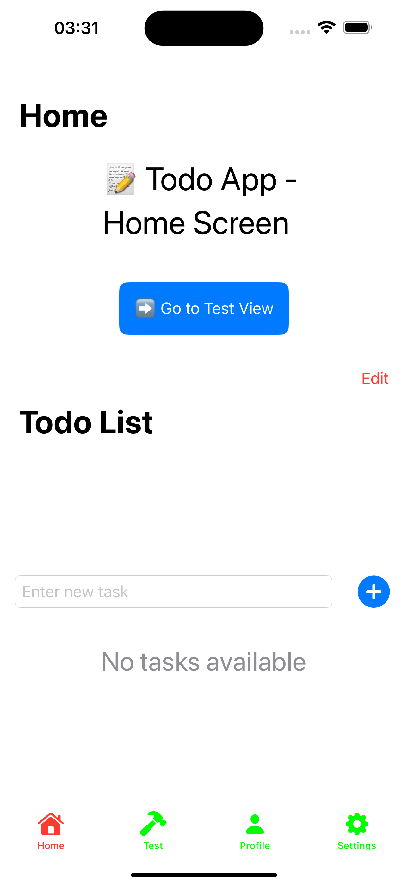

Here’s a **simplified and cleaned-up** version of your README:


# **TodoSwift** – A Simple Todo App in SwiftUI 🚀

## 📚 Learn More About MVVM

For a detailed explanation of the MVVM structure, check out the [MVVM Structure Guide](./MVVM_Structure_Guide.md).


## **🛠 Stage 1: Initial Screen & Todo Logic**
- Designed a **clean UI** for the **Home Screen**.
- Implemented a **Todo List** with:
  - ➕ **Add tasks**
  - ✏️ **Edit tasks**
  - ❌ **Delete tasks**
- Used **SwiftUI & MVVM** for state management.
- Stored tasks using **UserDefaults**.

## **🛠 Stage 2: Basic Tabs**
- Integrated **TabView** for navigation between:
  - 🏡 **Home**
  - 🔨 **Test**
  - 👤 **Profile**
  - ⚙️ **Settings**



## **📜 Features**
✅ Add, Edit, and Delete tasks  
✅ **MVVM architecture** for better structure  
✅ **SwiftUI Navigation** for smooth transitions  
✅ **UserDefaults (later Core Data)** for persistence  
✅ **Tab-based Navigation**  

## **📂 Project Structure**

```markdown
📦 TodoSwift
 ├── 📂 Models         # Data models (TodoItem)
 ├── 📂 ViewModels     # Business logic & state
 ├── 📂 Views          # UI screens
 ├── 📂 Services       # Data handling (PersistenceService)
 ├── 📂 Assets         # App resources (images, icons)
 ├── 🟠 TodoSwiftApp.swift  # App entry point
 ├── 📝 README.md      # Project documentation
 ├── 📜 Info.plist     # App metadata & config
 └── 📂 Tests          # Unit & UI tests
```

## **🚀 Installation & Setup**
```sh
git clone https://github.com/YOUR_GITHUB_USERNAME/TodoSwift.git
cd TodoSwift
```
- Open `TodoSwift.xcodeproj` in **Xcode**.
- Set the **deployment target**.
- Run the app: **Cmd (⌘) + R**.

## **🤖 Future Improvements**
- Implement **Core Data** for persistence  
- Add **CloudKit Syncing**  
- Enable **Push Notifications**  
- Support **Dark Mode** 🌙  

## **📜 License**
Licensed under the **MIT License**.

## **👨‍💻 Contributing**
Fork the repo and submit a pull request!  

📩 **Contact:** [Your GitHub Profile](https://github.com/YOUR_GITHUB_USERNAME)  

---

🎉 **Happy Coding!** 🚀

### **Changes & Optimizations:**
✅ Removed unnecessary repetitions  
✅ Simplified explanations  
✅ Kept the README concise but **clear**  

This keeps your documentation **straight to the point** while still informative! Let me know if you want any more refinements. 😊
